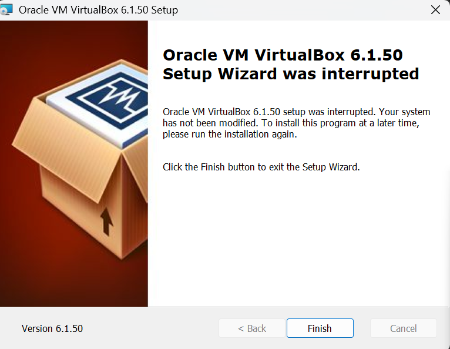
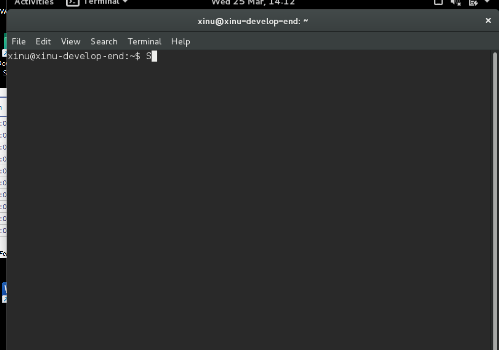

# <h1 align="center"> Laporan Praktikum Modul 1   Running Modul </h1>

Dimas Angga Sulistyo Nugroho - 2211104086

## Dasar Teori

Praktikum running modul pada mata kuliah sistem operasi adalah kegiatan menjalankan dan menguji sebuah program atau modul  untuk memahami bagaimana sistem operasi bekerja secara langsung, mulai dari proses eksekusi, manajemen memori, hingga interaksi antara user dan kernel. Dalam praktikum ini, mahasiswa biasanya melakukan compile kode, menjalankan program melalui terminal, serta mengamati hasilnya menggunakan perintah seperti ps. Melalui proses ini, mahasiswa dapat melihat bagaimana sistem operasi mengelola proses, resource, dan komunikasi dengan perangkat keras,sehingga pemahaman yang diperoleh tidak hanya bersifat teori tetapi juga praktik nyata.

## Guided

### 01

### 02 

## Referensi

### 01 https://medium.com/@ighfirmaulana/talking-to-my-operating-system-exploring-xinu-from-the-inside-module-3-033224e6268d
