# <h1 align="center">Laporan Praktikum Modul 3    </h1>

Dimas Angga Sulistyo Nugroho - 2211104086

## Dasar Teori

Xinu (eXtensible Interactive Network Unix) adalah sistem operasi sederhana yang dirancang untuk tujuan pendidikan, khususnya dalam memahami konsep dasar sistem operasi seperti manajemen proses, memori, dan jaringan. Sistem operasi sendiri berfungsi sebagai penghubung antara pengguna dan perangkat keras komputer, serta mengatur sumber daya seperti CPU, memori, dan perangkat input/output agar dapat digunakan secara efisien. Xinu memiliki karakteristik sederhana, modular, dan mendukung multitasking, sehingga memudahkan pengguna dalam mempelajari bagaimana sebuah sistem operasi bekerja secara internal.

Dalam penggunaannya, Xinu menyediakan shell sebagai antarmuka berbasis perinta(command line) yang memungkinkan pengguna berinteraksi langsung dengan sistem.Beberapa perintah yang umum digunakan antara lain help untuk menampilkan daftar perintah, ps untuk melihat proses yang berjalan, echo untuk menampilkan teks ping untuk menguji koneksi jaringan, serta uptime untuk mengetahui lama sistem berjalan.Selain itu, Xinu juga mendukung manajemen proses dengan berbagai state seperti running, ready, dan suspended, serta menyediakan informasi jaringan seperti IP address. Jumlah dan jenis perintah pada Xinu dapat berbeda-beda tergantung versi dan konfigurasi sistem yang digunakan.

## Guided

### 01 Help : Perintah help digunakan untuk menampilkan daftar seluruh perintah yang tersedia pada sistem Xinu.
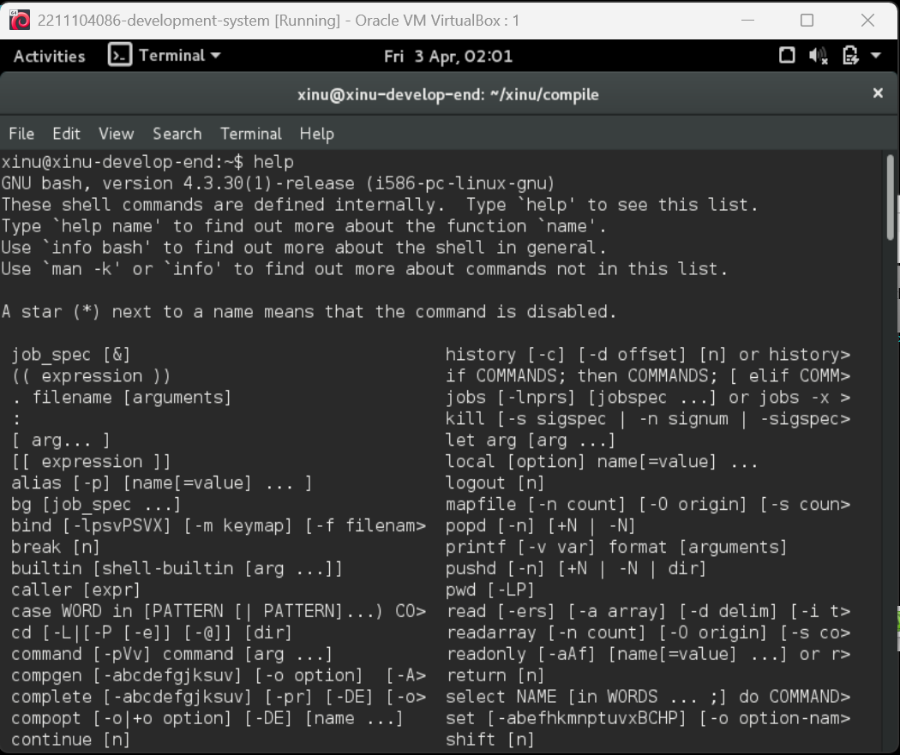

### 02 Clear : Perintah clear digunakan untuk membersihkan tampilan layar terminal sehingga tampilan menjadi kosong dan lebih rapi untuk penggunaan berikutnya.
**Sebelum Perintah clear
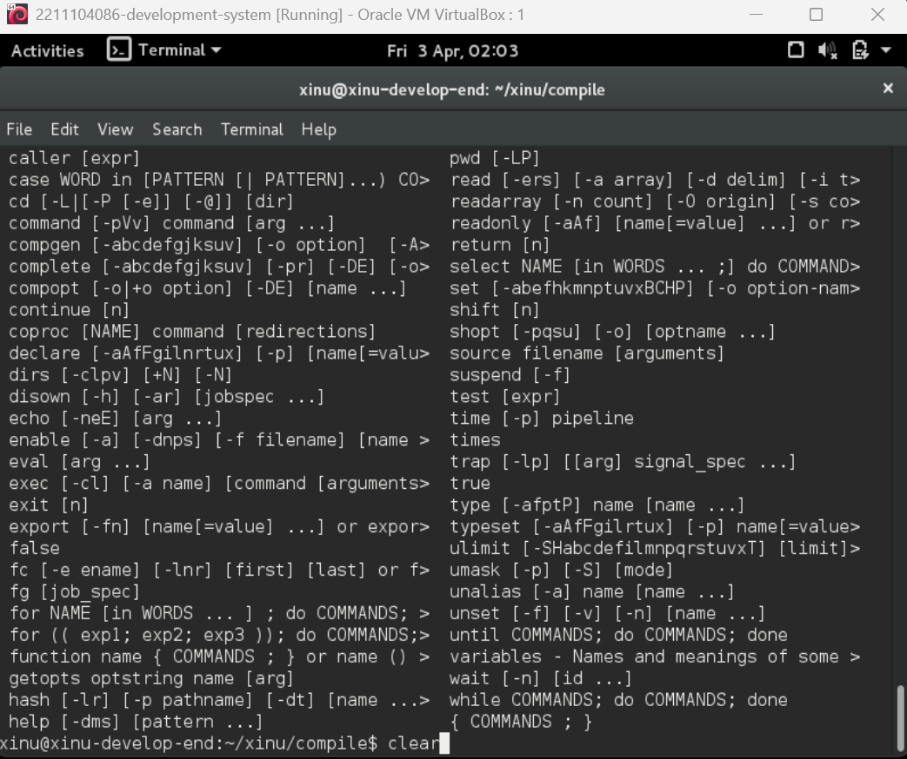
**Sesudah perintah clear
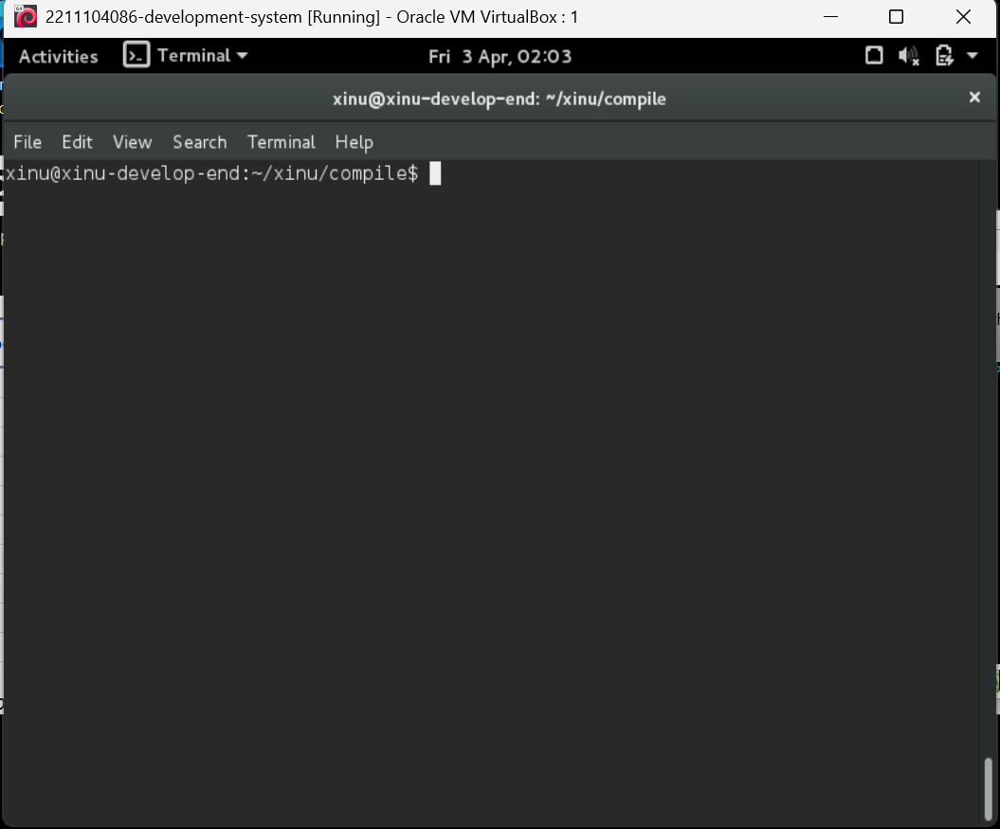

### 03 Date : Perintah date digunakan untuk menampilkan informasi tanggal dan waktu pada sistem. Informasi ini berguna untuk mengetahui waktu saat sistem sedang berjalan.
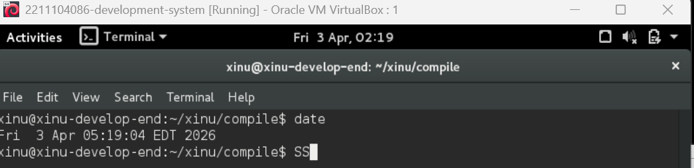

### 04 ls : Perintah ls digunakan untuk menampilkan daftar file atau direktori yang terdapat dalam sistem. Perintah ini membantu pengguna dalam mengetahui file apa saja yang tersedia.
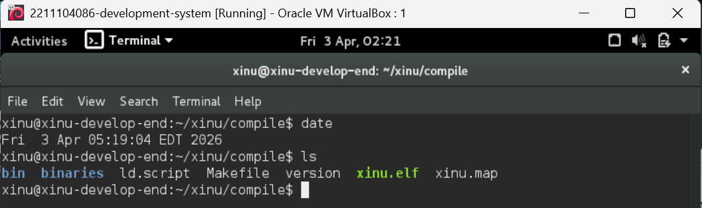

### 05 uptime : Perintah uptime digunakan untuk menampilkan lama waktu sistem telah berjalan sejak pertama kali dinyalakan. Informasi ini berguna untuk mengetahui stabilitas sistem.
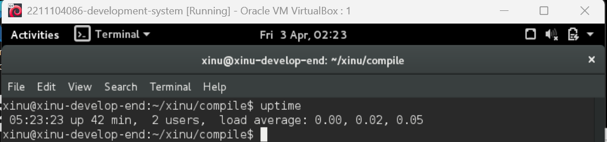

### 06 ping : Perintah ping berfungsi untuk menguji konektivitas jaringan ke suatu alamat IP. Jika koneksi berhasil, sistem akan menampilkan balasan (reply) dari alamat tujuan.
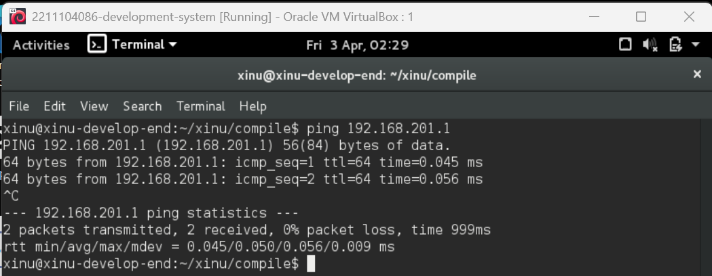

### 07 echo : Perintah echo berfungsi untuk menampilkan teks atau string ke layar. Perintah ini biasanya digunakan untuk mengetes output atau menampilkan pesan sederhana pada shell.
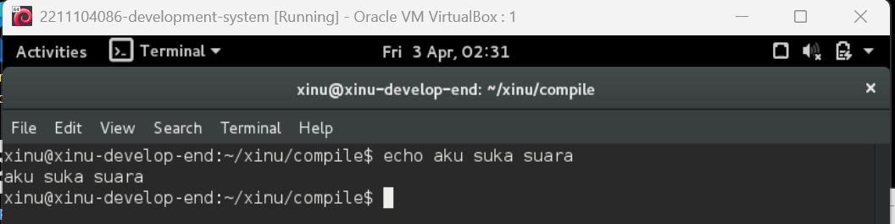

### 08 cat : Perintah cat berfungsi untuk menampilkan isi dari suatu file ke layar. Dengan perintah ini, pengguna dapat membaca isi file tanpa harus membuka editor.
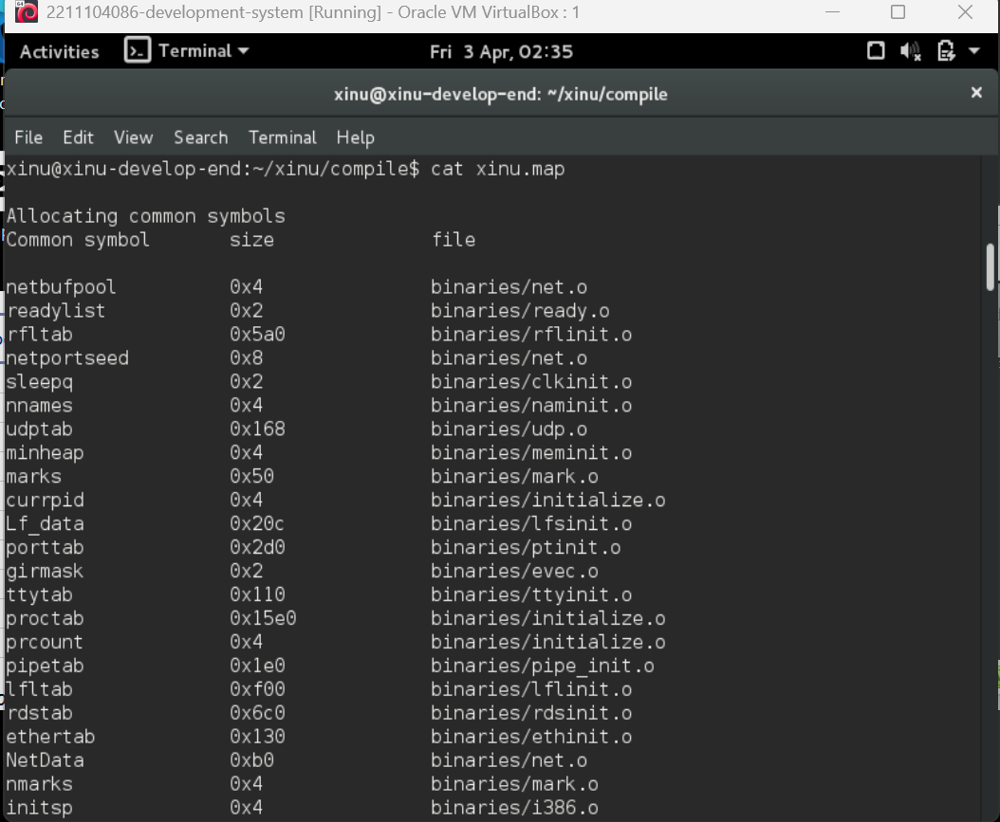

### 09 tee : Perintah tee digunakan untuk menampilkan output ke layar sekaligus menyimpannya ke dalam file. Perintah ini biasanya digunakan bersama dengan pipe (|) untuk mendokumentasikan hasil output.
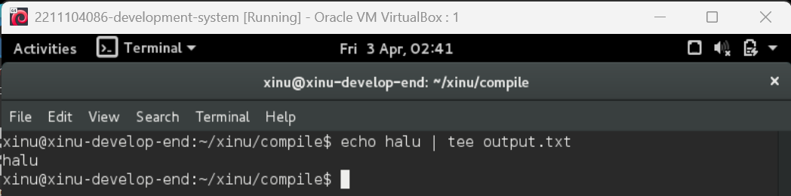

### 10 ps : Perintah ps digunakan untuk menampilkan daftar proses yang sedang berjalan pada sistem Xinu. Output dari perintah ini berisi informasi seperti Process ID (PID), nama proses, status proses (state), prioritas, dan penggunaan memori (stack). Dengan perintah ini, pengguna dapat mengetahui kondisi sistem dan proses yang sedang aktif.
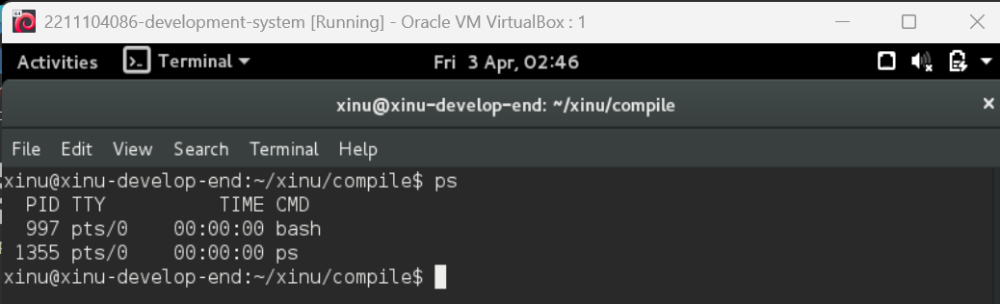

## Soal Jawablah pertanyaan-pertanyaan berikut ini:
1. Berapa jumlah perintah pada Xinu? 
jawab: Sekitar 20–25 perintah (tergantung versi Xinu).
2. Sebutkan 2 perintah yang mempunyai fungsi yang sama! 
jawab: Contoh: exit dan kill (sama-sama untuk menghentikan proses).
3. Berapa IP address Xinu?  
jawab: 192.168.1.2 (tergantung konfigurasi).
4. Perintah apa yang digunakan untuk mengetahui IP address? 
jawab: ifconfig
5. Berapa IP DNS server yang digunakan oleh Xinu? 
jawab: 192.168.1.1
6. Terdapat berapa proses yang sedang berjalan pada Xinu? 
jawab: 8–10 proses.
7. Proses apa yang mempunyai prioritas paling rendah? 
jawab: Null process
8. Proses apa yang mempunyai ukuran paling besar? 
jawab: Main process
9. Proses apa yang berada dalam state current? 
jawab: Main process (proses yang sedang berjalan)
10. Proses apa yang berada dalam state suspend? 
jawab: Proses yang sedang ditunda/menunggu, biasanya proses selain main (tergantung kondisi sistem).
11. Berapa PID (Process ID) dari Main process? 
jawab: 0 atau 1 (tergantung implementasi Xinu)

## Referensi

1. https://en.wikipedia.org/wiki/Data_structure (diakses blablabla)