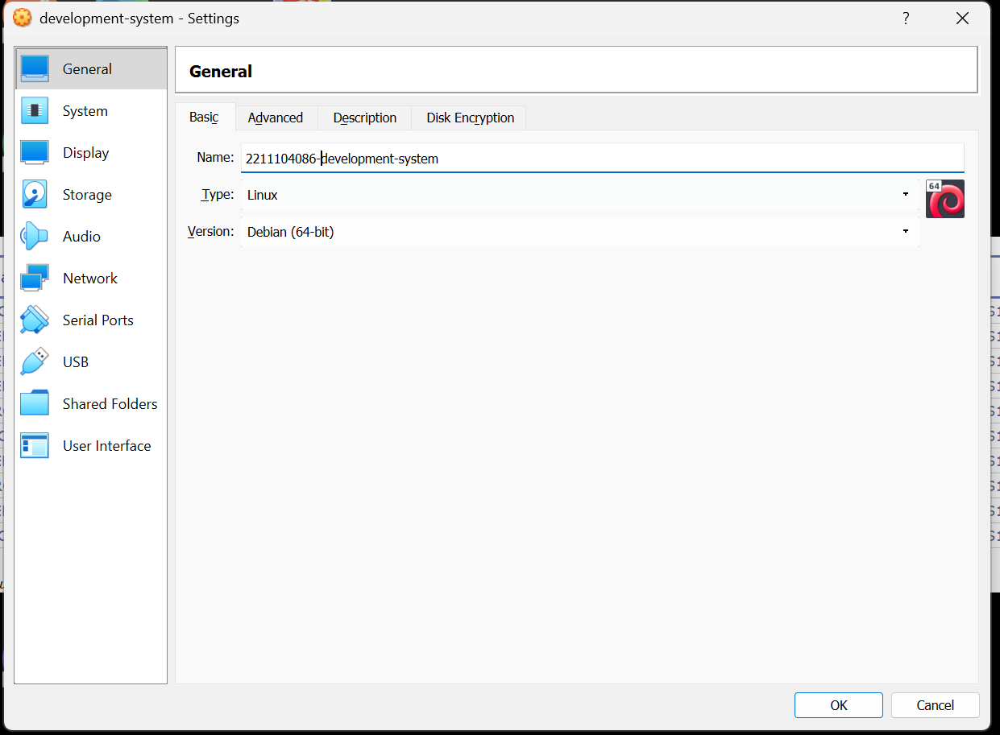
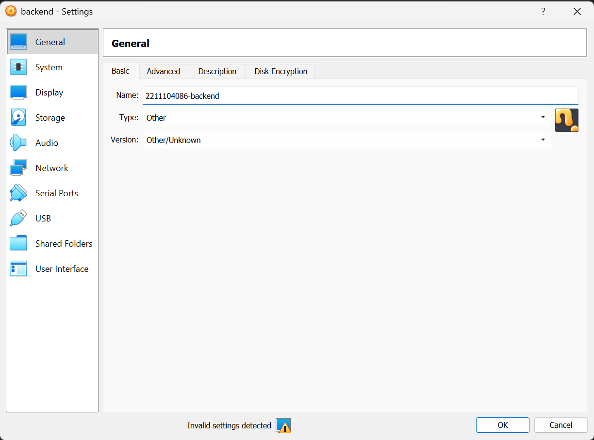
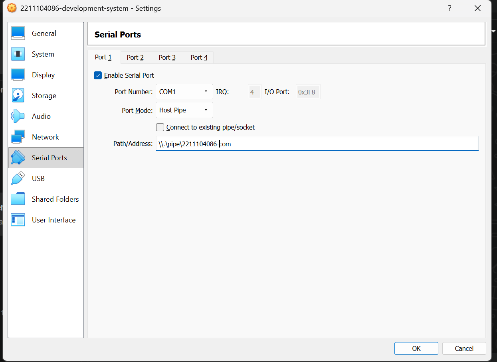
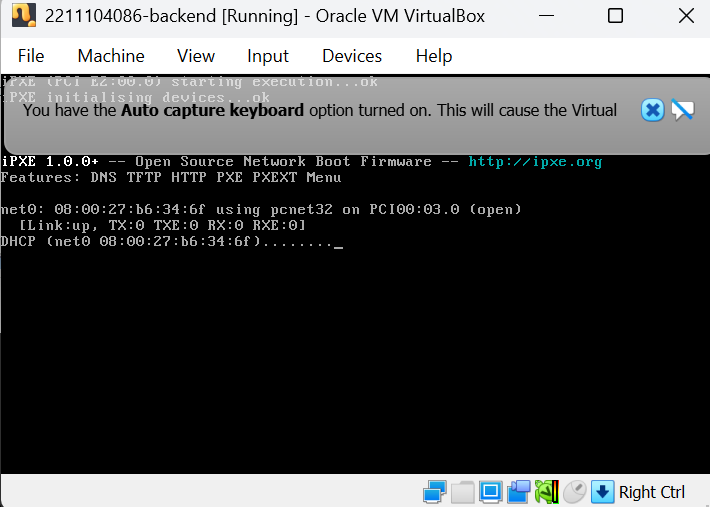
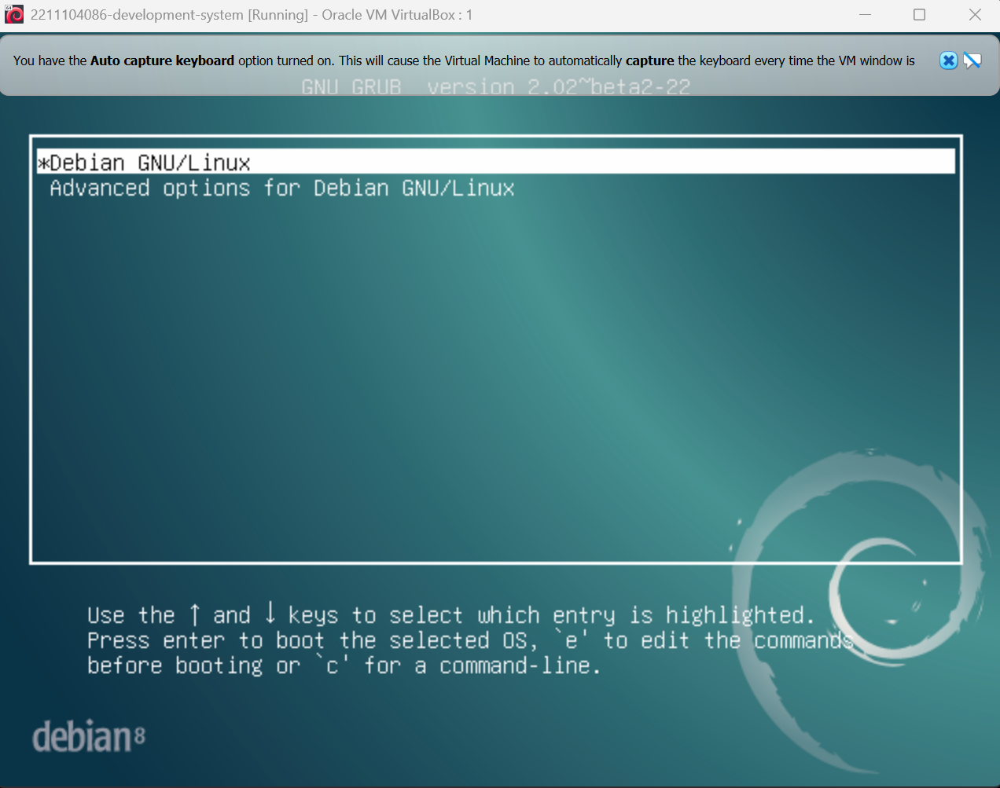
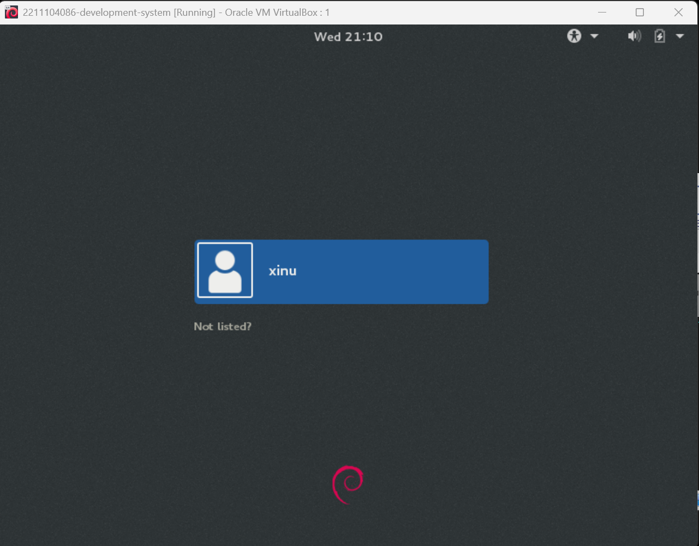
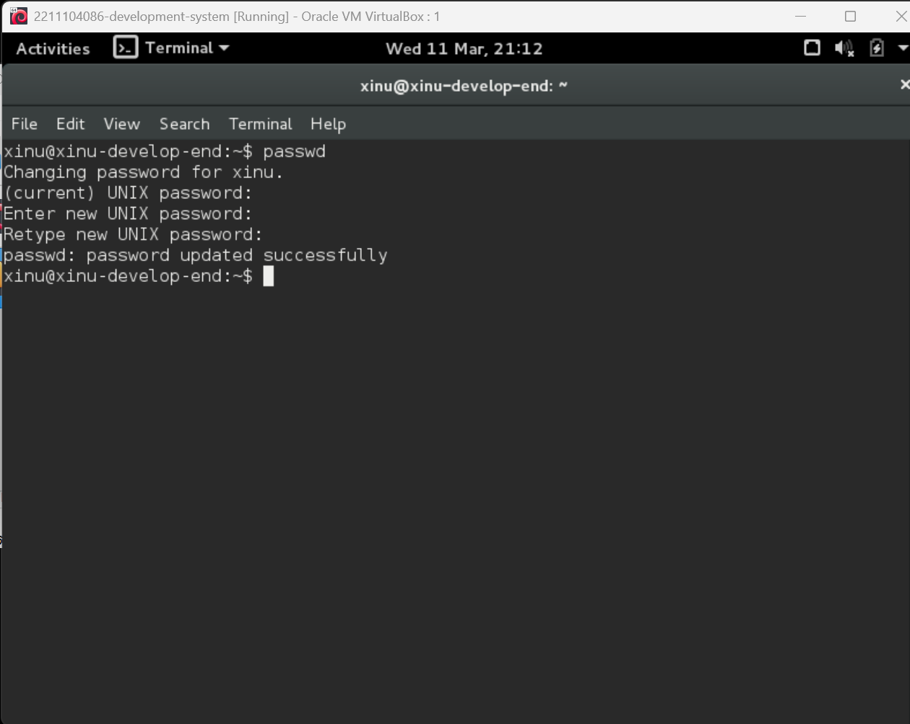

# <h1 align="center">Laporan Praktikum Modul 2  Instalasi Xinu</h1>

Dimas Angga Sulistyo Nurgoho - 2211104086

## Dasar Teori

Xinu adalah sistem operasi berorientasi objek yang kecil, elegan, dan dinamis, berbeda dengan OS modern yang sangat kompleks, Xinu dirancang agar mahasiswa dapat memahami setiap baris kodenya. Xinu sebagai alat pembelajaran bagi mahasiswa untuk memahami bagaimana sistem operasi berkerja secara langsung.

## Guided

### 1. Mengganti Nama development system menjadi NIM-development-system

### 2. Mengganti Nama backend menjadi NIM-backend

### 3. Mengganti serial port development system menjadi \.\pipe\NIM_com

### 4. Mengganti serial port backend menjadi \.\pipe\NIM_com

### 5. Menjalankan backend 

### 6. Menjalankan development system 

### 7. Berhasil menjalankan development system 

### 8. Mengganti passworld 

